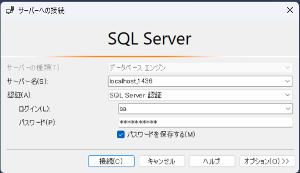
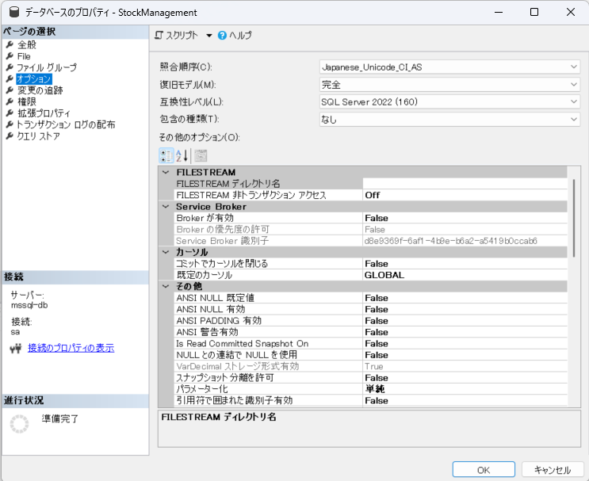

# SQL Server 2022 導入手順
1. これを実行します
```Shell
docker pull mcr.microsoft.com/mssql/server:2022-latest
```
2. 他に使っている docker-compose.yml の MSSQL_TCP_PORT と ports を変更してください
3. 以下を実行してください
```Shell
docker-compose build
docker-compose up -d
```
4. SSMS等 DBツールで接続 デフォルトであれば以下の設定で入れます
   1. サーバー名：localhost,1436
   2. ログイン：sa
   3. パスワード：local2022!
   
5. DBに日本語の文字列をインサートしたら ????? みたいになった場合は照合順序を「Japanese_Unicode_CI_AS」にする
   